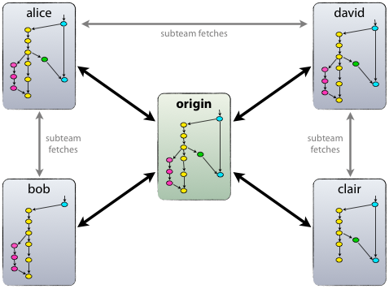
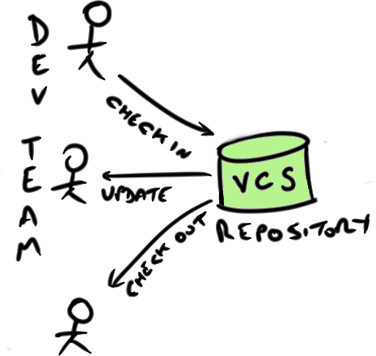

# Git
## Advanced training

:zap: Powered by [remarkjs](https://github.com/gnab/remark).

---

# Summary

## I. Basics
## II. HOWTOs
## III. Git Flow
## IV. Tips

---

# Basics

- Distributed != Centralised




- Basic commands

```
$ git init
$ git status
$ git add <filepath>
$ git commit -m <message>
$ git push <remote> <branch>
```

- Ignore files : **.gitignore**


---

# HOWTOs

- How to setup git ?
```
$ git config --global user.name <username>
$ git config --global user.email <email>
```
- How to choose my editor ?
```
$ git config --global core.editor vim
```
- How to generate a ssh key ?
```
$ ssh-keygen -t rsa -b 4096 -C <email>
```
- How to add a remote repository ?
```
$ git remote add origin git@github.com:<user>/<repo>.git
```
- How to change a remote repository url ?
```
$ git remote set-url origin git@github.com:<user>/<repo>.git
```

---

# HOWTOs

- How to untrack a file without deleting it ?
```
$ echo <filename> >> .gitignore
$ git rm --cached <filename>
$ git add <filename>
```
- How to view my local changes ?
```
$ git diff
```
- How to view the commit list ?
```
$ git log --oneline --decorate --graph
```
- How to pull without having to commit ?
```
$ git stash
$ git pull <remote> <branch>
$ git stash pop
```

---

# HOWTOs

- How to create a branch ?
```
$ git checkout -b <branch>
```
- How to keep a file in the repository but disable change tracking ?
```
$ git update-index --assume-unchanged <filename>
```
- How to reactivate change tracking ?
```
$ git update-index --no-assume-unchanged <filename>
```
- How to edit my last commit ? (I forgot one file, I made a typo in the commit message)
```
$ git add <file>
$ git commit --amend
# or if I don't want to change the commit message
$ git commit --amend --no-edit
```


---

# HOWTOs

- How to undo my changes ?
```
$ git status
# Before ``git add``
$ git checkout -- <filename>
# After ``git add``
$ git reset HEAD <filename>
$ git checkout -- <filename>
```
- How to uncommit ?
```
# If I want to keep my changes
$ git reset --soft HEAD~1
# If I want to delete my changes
$ git reset --hard HEAD~1
# Then if I have already pushed to the remote repository
# I may need to disable branch protection
$ git push <remote> <branch> -f
```

---

# HOWTOs

- How to merge a list of commit ?
```
$ git rebase -i HEAD~<numberOfCommits>
pick 1b68a67 :bug: Fix #27
squash 6b36b82 :wrench: Replace config files with env variables.
squash 3da99cc :heavy_minus_sign: :heavy_plus_sign: Replace node-uuid by uuid
squash 5e6c751 :arrow_up: Upgrading dependencies
# Rebase 479f697..5e6c751 onto 479f697 (4 command(s))
#
# Commands:
# p, pick = use commit
# r, reword = use commit, but edit the commit message
# e, edit = use commit, but stop for amending
# s, squash = use commit, but meld into previous commit
# f, fixup = like "squash", but discard this commit's log message
# x, exec = run command (the rest of the line) using shell
# d, drop = remove commit
```

---

# HOWTOs

- How to pull commits from a remote repository without creating a merge commit ?
```
# git pull = git fetch + git merge
# git pull --rebase = git fetch + git rebase
$ git pull --rebase <remote> <branch>
```
- How to set **rebase** as default ?
```
$ git config --global pull.rebase true
```
- How to solve conflict when rebasing ?
```
$ git pull
# Snap! Conflict!
$ vim <filename>
$ git add <filename>
$ git rebase --continue
# Or if I want to abort
$ git rebase --abort
```

---

# HOWTOs

- How to run some scripts before committing ?
```
$ mv .git/hooks/precommit.sample .git/hooks/precommit
$ vim .git/hooks/precommit
#!/bin/bash
npm run lint
npm run test
npm run build
```

- Git hooks are very handy to run scripts before or after some events :
  - pre-commit
  - pre-push
  - pre-rebase
  - prepare-commit-msg

</script>

---

# Git Flow

- Master : protected production branch
- Develop : protected staging branch
- Feature branches :
```
# Create
$ git checkout -b <featurename> develop
# Merging
$ git checkout develop
$ git merge --no-ff <featurename>
$ git branch -d <featurename>
$ git push origin develop
```
- Release branches : naming convention e.g **release-**
```
$ git checkout -b release-<version> develop
# Bump version number
$ git commit -a -m "Bumped version number to <version>"
$ git push origin release-<version>
# Merge in master
$ git checkout master
$ git merge --no-ff release-<version>
$ git tag -a 1.2
# Merge in develop
$ git checkout develop
$ git merge --no-ff release-<version>
```

---

# Git Flow

- Hotfix branches : naming convention e.g **hotfix-**
```
$ git checkout -b hotfix-<nextversion> master
# First bump the version
$ git commit -a -m "Bumped version number to <nextversion>"
# Then fix the bug
$ git commit -m "Fixed severe production problem"
# Merge in master
$ git checkout master
$ git merge --no-ff hotfix-<nextversion>
$ git tag -a <nextversion>
# Merge in develop or in current release branch if release branch hasn't been merged yet
$ git checkout develop
$ git merge --no-ff <nextversion>
```
- See [Vincent Driessen's post](http://nvie.com/posts/a-successful-git-branching-model/) for more details

---

# Git Flow

### Main branches


---

# Git Flow

### Feature branches


---

# Git Flow

### Merge without ff


---

# Git Flow

### Hotfixes branches


---

# Git Flow


---

# Advices

- Use rebase !
- Do not :
```
$ git add .
$ git commit -a
```
- Before committing always :
```
$ git status
$ git diff
```
- Use aliases
```
alias gst  ='git status'
alias gd   ='git diff'
alias gl   ='git pull'
alias ga   ='git add'
alias gc   = 'git commit -v'
alias gc!  ='git commit -v --amend'
alias gcn! ='git commit -v --no-edit --amend'
alias gp   ='git push'
alias gcb  ='git checkout -b'
alias glog ='git log --oneline --decorate --graph'
```

---

# Advices

- Use [gitmoji](https://gitmoji.carloscuesta.me/)
- Use git & github for your personnal projects to learn (like this presentation)

---

# The end.
